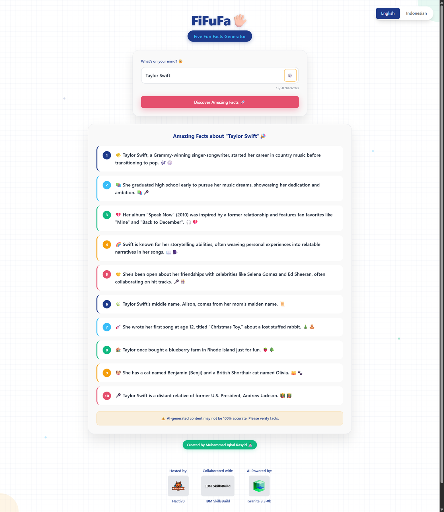

# FiFuFa 🖐🏻💡

> Your AI-Powered Five Fun Facts Generator — fast, fun, and bilingual.

[🌐 Live App](https://fi-fu-fa-deploy.vercel.app/) • [🎥 Presentation Video](https://youtu.be/F2Xs3b5JRhw?si=hTCmskCpwI3mOX1w) • [📂 GitHub Repo](https://github.com/Otachiking/FiFuFa-Ver4) • [🧑🏻‍💻 Instagram](https://instagram.com/otachiking)

## 📌 Project Description
FiFuFa is a full-stack web application that instantly generates **five fun facts** based on any topic — from historical figures and monuments to pop culture or fictional characters. Designed to be both educational and entertaining, it works great as a tool for general knowledge and also as a casual **ice breaker**.

It’s accessible to everyone: **kids, teens, and adults**, in both **English and Indonesian**.

---

## 🧠 Technologies Used

- **Frontend**: React, Vite, Tailwind CSS, Framer Motion
- **Backend**: Node.js, Express.js
- **AI Model**: IBM Granite 3.3-8B (via Replicate API)
- **Tools**: VS Code, GitHub, Canva, Figma

---

## 🚀 Main Features

- 🎯 **Five Fun Facts Generator**  
  Instantly shows 5 unique facts about any topic (historical, fictional, cultural, etc.)

- 🎲 **Random Topic Dice**  
  Don’t know what to ask? Roll the dice and get random ideas!

- 🌍 **Bilingual Support**  
  Choose between English and Bahasa Indonesia seamlessly

- 🧪 **Fail-safe System**  
  In case of API error, fallback fact list is activated so the app never breaks

- 🧼 **Prompt Optimization + RegEx Clean-up**  
  Ensures clear, numbered, and trimmed outputs

- 📱 **Responsive UI**  
  Works beautifully across desktop and mobile with animated transitions

---

## 🌟 Added Value

- ♿️ **Accessibility First**  
  Full support for ARIA labels, alt texts, and keyboard navigation

- 📂 **Backend Logging**  
  Error logs and request tracking in JSON format

- 📉 **Low-cost & Efficient AI Prompting**  
  Optimized prompt saves tokens and API costs

- 🧽 **Content Sanitization**  
  Auto-filters unnecessary punctuation, numberings, or markdown noise
---

## 🧠 AI Support Explanation


FiFuFa is powered by **IBM Granite 3.3-8B Instruct**, accessed securely via the **Replicate API**.
The AI is responsible for generating both **fun facts** and **random topics** based on user input.


### How It Works:
1. 🎲 **Random Dice Generator** — When users are unsure what to search, FiFuFa can generate **6 random topic ideas** instantly, offering inspiration from culture, history, and pop trends.
2. ⚙️ **Dynamic Prompting** — Each request dynamically builds a tailored prompt in either English or Bahasa Indonesia using optimized temperature, token limits, and penalties for balanced creativity and accuracy.
3. 🧠 **Smart Validation** — Input topics are sanitized and validated (2–50 characters).
Invalid or missing topics trigger friendly fallback messages.
4. 🧮 **RegEx Post-Processing** — The output from IBM Granite is cleaned using **regular expressions** to remove numbering, markdown noise, and ensure clear, polished results.
5. 🌍 **Bilingual Output** — The final facts are presented in **English** or **Bahasa Indonesia**, automatically matching the user’s selected mode.


### Why IBM Granite?
IBM Granite is designed for **enterprise-grade applications**, ensuring high **security**, **privacy**, and **efficient token usage**.
These characteristics make it ideal for an **educational and interactive AI app** like FiFuFa.


---

## 📸 Screenshots

> Inline preview of the app in action 👇

| English Mode | Indonesian Mode |
|--------------|------------------|
|  |  |

---

## 🛠️ How to Run Locally

### Backend (📁 `fifufa-be`)

```bash
cd fifufa-be
npm install
npm start
```

### Frontend (📁 `fifufa-ui`)

```bash
cd fifufa-ui
npm install
npm run dev
```

## 📄 License

MIT — feel free to fork, enhance, and deploy with credit.

---

Made with 💙 by **Muhammad Iqbal Rasyid** — Code Batch 20 (Wave 11)
